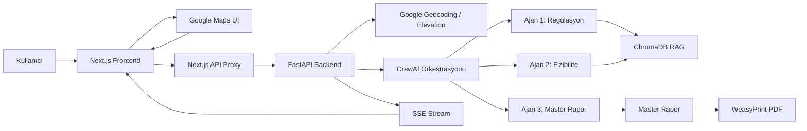

# EKSEN

<p align="center">
  <strong>Taktiksel Uydu Altyapı ve Haberleşme Optimizasyonu</strong>
</p>

<p align="center">
  <strong>Revio</strong> tarafından geliştirilen EKSEN, seçilen saha koordinatları için uydu haberleşme mimarisi, regülasyon uygunluğu, fizibilite, maliyet ve nihai karar raporu üreten çok ajanlı analiz platformudur.
</p>

<p align="center">
  
  
  
  
  
</p>

---

## İçindekiler

- [Proje Özeti](#proje-özeti)
- [Temel Kabiliyetler](#temel-kabiliyetler)
- [Mimari](#mimari)
- [Ajan Sistemi](#ajan-sistemi)
- [Coğrafi ve Jeopolitik Tutarlılık](#coğrafi-ve-jeopolitik-tutarlılık)
- [RAG Bilgi Tabanı](#rag-bilgi-tabanı)
- [PDF ve Raporlama](#pdf-ve-raporlama)
- [Kurulum](#kurulum)
- [Çalıştırma](#çalıştırma)
- [Ortam Değişkenleri](#ortam-değişkenleri)
- [API Referansı](#api-referansı)
- [SSE Akış Şeması](#sse-akış-şeması)
- [Failover ve Güvenli Modlar](#failover-ve-güvenli-modlar)
- [Test ve Doğrulama](#test-ve-doğrulama)
- [Proje Yapısı](#proje-yapısı)
- [Geliştirme Notları](#geliştirme-notları)

---

## Proje Özeti

Eksen; Türkiye ve yakın çevresindeki kritik saha lokasyonları için uydu haberleşme karar desteği sağlar. Kullanıcı harita üzerinden bir koordinat seçer, sistem bu koordinatı Google Maps servisleriyle zenginleştirir, ardından backend tarafında çok ajanlı CrewAI akışı çalışır.

Platformun amacı yalnızca teknik bir rapor üretmek değildir. EKSEN, koordinatın jeopolitik bağlamını, ülke regülasyonlarını, uydu sağlayıcısı uygunluğunu, topoğrafik riski, maliyeti ve operasyonel süreklilik ihtiyacını birlikte değerlendirir.

---

## Temel Kabiliyetler

| Alan | Açıklama |
| --- | --- |
| Etkileşimli harita | React tabanlı ülke haritası ve Google Maps koordinat seçimi |
| Rakım ve ülke tespiti | Google Elevation API ve Geocoding API entegrasyonu |
| Çok ajanlı analiz | CrewAI ile regülasyon, fizibilite ve master rapor ajanları |
| RAG destekli karar | ChromaDB + SentenceTransformers ile ülke bazlı doküman arama |
| SSE canlı yayın | Backend ajan çıktılarının frontend terminallerine gerçek zamanlı akışı |
| Katı ajan izolasyonu | Ajan 1, Ajan 2 ve Ajan 3 loglarının ayrı state kanallarında tutulması |
| Dinamik sağlayıcı matrisi | Ülkeye göre Türksat, Eutelsat, Intelsat, Hellas Sat, Arabsat kararları |
| İç bölge / sınır ayrımı | Kırıkkale gibi iç bölgelerde sınır söylemini otomatik engelleme |
| Demo / kota failover | OpenRouter kota ve bağlantı sorunlarında güvenli yedek rapor |
| PDF üretimi | Backend WeasyPrint PDF, frontend tarayıcı baskı fallback'i |
| Türkçe rapor kalitesi | Türkçe karakter, yabancı alfabe temizleme ve Markdown standardizasyonu |

---

## Mimari



### Ana Katmanlar

| Katman | Teknoloji | Rol |
| --- | --- | --- |
| Frontend | Next.js, React, Tailwind, Framer Motion | Harita, analiz konsolu, terminal UI, PDF indirme |
| API Proxy | Next.js Route Handlers | Frontend ile FastAPI arasında SSE ve PDF proxy |
| Backend | FastAPI, Pydantic, Uvicorn | Analiz endpointleri, SSE, PDF endpointi, Google servisleri |
| AI Orkestrasyon | CrewAI, OpenRouter LLM | Çok ajanlı analiz ve master rapor üretimi |
| Bilgi Tabanı | ChromaDB, SentenceTransformers | Ülke bazlı regülasyon ve uydu haberleşme doküman arama |
| PDF | WeasyPrint | UTF-8 uyumlu kurumsal PDF üretimi |

---

## Ajan Sistemi

Eksen üç ana ajanla çalışır.

### Ajan 1: Regülasyon ve Kapsama Analisti

Görevleri:

- Koordinatın ülke ve bölge bağlamını analiz eder.
- GEO / LEO kapsama ve lisans gereksinimlerini değerlendirir.
- RAG aracı olan `bolgesel_regulasyon_arama_araci` ile ülke dokümanlarını tarar.
- BTK, CRA, CMC, SYTRA, EETT gibi ülke otoritelerini bağlama göre değerlendirir.

### Ajan 2: VSAT Fizibilite ve Donanım Mühendisi

Görevleri:

- Anten boyutu, modem, router ve yedek erişim mimarisini değerlendirir.
- CAPEX, OPEX ve 3 yıllık TCO hesabı üretir.
- Rakım, saha erişimi ve topoğrafik zorluk profilini maliyete bağlar.
- İç bölge, kıyı bölgesi ve sınır hattı için farklı risk dili kullanır.

### Ajan 3: Teknik Rapor Yazıcı ve Koordinatör

Görevleri:

- Ajan 1 ve Ajan 2 çıktısını tek master raporda sentezler.
- Raporu kurumsal Türkçe, Markdown ve tablo formatında üretir.
- `SEÇİLEN OPSİYON` başlığını raporun en üstüne koyar.
- Ülke-sağlayıcı matrisiyle çelişen önerileri engeller.
- İç bölgelerde "sınır hattı koruması" yerine merkezi altyapı yedekliliği dilini kullanır.

---

## Coğrafi ve Jeopolitik Tutarlılık

Eksen, ezbere sağlayıcı ve bölge etiketi basmamak için iki ayrı karar katmanı kullanır.

### 1. Bölge Tipi Sınıflandırması

Backend ve frontend tarafında koordinat sınıflandırılır:

| Bölge tipi | Örnek | Kullanılan görev dili |
| --- | --- | --- |
| `interior` | Kırıkkale, Ankara, Konya | Merkezi Altyapı Redundancy ve Stratejik İletişim Güvenliği |
| `border` | Hakkari, Hatay, Edirne | Sınır hattı sürekliliği ve taktik haberleşme güvenliği |
| `coastal` | Kıyıya yakın sahalar | Kıyı şeridi haberleşme sürekliliği ve yedek erişim |

Kırıkkale örneği:

```text
Kırıkkale Stratejik Sanayi ve Üretim Bölgesi (İç Altyapı Omurgası)
```

Bu durumda raporda şunlar engellenir:

- `Kırıkkale Sınır Bölgesi`
- `Sınır Hattı`
- `Sınır ötesi operasyon sahası`
- `sınır güvenliği` gerekçesi

### 2. Ülke - Uydu Sağlayıcı Matrisi

| Ülke / Bölge | Birincil GEO önerisi | Not |
| --- | --- | --- |
| Türkiye iç bölge | TÜRKSAT GEO VSAT | Gerekçe: karasal hatlara karşı merkezi yedekleme |
| Türkiye resmi sınır / operasyon sahası | TÜRKSAT GEO VSAT | Gerekçe: taktik saha sürekliliği |
| İran | INTELSAT / EUTELSAT MEA BEAM veya İran ulusal uydu şebekesi | Türksat yasaktır |
| Suriye | EUTELSAT / ARABSAT OMNI OMA | Türksat birincil omurga değildir |
| Yunanistan / Bulgaristan | HELLAS SAT veya EUTELSAT KONNECT | Yerel ve bölgesel uyum önceliklidir |

---

## RAG Bilgi Tabanı

RAG katmanı `docs/` altındaki ülke bazlı dokümanları işler.

Desteklenen formatlar:

- `.txt`
- `.md`
- `.rst`
- `.pdf`
- `.docx`

Teknik ayarlar:

| Parametre | Değer |
| --- | --- |
| Vektör veritabanı | ChromaDB |
| Embedding modeli | `all-MiniLM-L6-v2` |
| Chunk boyutu | `800` |
| Chunk overlap | `120` |
| Maksimum sonuç | `3` |
| Collection | `global_connectivity_regulation_docs` |

Dokümanlar ülke kodu klasörlerinde tutulur:

```text
docs/
  TR/
  IR/
  IQ/
  SY/
  AZ/
  BG/
  GE/
  AM/
  GR/
  CY/
```

RAG aracı yalnızca ilgili ülke dokümanlarında arama yapar. Bu tasarım modelin ezbere bilgi üretmesini azaltır ve kararların kaynak dokümanlara dayanmasını sağlar.

---

## PDF ve Raporlama

EKSEN iki katmanlı PDF yaklaşımı kullanır.

### Backend PDF

`POST /api/v1/download-pdf` endpoint'i master raporu alır ve WeasyPrint ile PDF üretir.

Özellikler:

- UTF-8 ve Türkçe karakter uyumu.
- Markdown başlık, tablo, liste ve kalın metin dönüşümü.
- A4 sayfa düzeni.
- Kurumsal renk paleti.

### Frontend Fallback

Backend PDF motoru hata verirse frontend `html2canvas` veya canvas tabanlı renk parser kullanmaz. Bunun yerine:

- UTF-8 meta etiketli yeni print penceresi açar.
- Sade ve güvenli CSS kullanır.
- Tarayıcının sistem PDF kaydetme penceresini tetikler.
- `lab()` / `oklch()` renk fonksiyonu hatalarından etkilenmez.

---

## Kurulum

### Gereksinimler

- Python 3.11+ önerilir.
- Node.js 20+ önerilir.
- npm
- Google Maps API anahtarı
- OpenRouter API anahtarı

### 1. Depoyu hazırlayın

```bash
cd /home/kirmizi/Desktop/project
```

### 2. Backend ortamı

```bash
python3 -m venv .venv
source .venv/bin/activate
pip install -r requirements.txt
```

### 3. Frontend ortamı

```bash
cd frontend
npm install
```

---

## Ortam Değişkenleri

### Backend `.env`

Kök dizinde `.env` dosyası oluşturun:

```env
OPENROUTER_API_KEY=sk-or-...
GOOGLE_MAPS_API_KEY=AIza...
```

Alternatif olarak Google Maps için şu isim de desteklenir:

```env
Maps_API_KEY=AIza...
```

Backend, CrewAI ve OpenTelemetry telemetrisini otomatik devre dışı bırakır:

```python
CREWAI_DISABLE_TELEMETRY=1
OTEL_SDK_DISABLED=true
```

### Frontend `.env.local`

`frontend/.env.local`:

```env
NEXT_PUBLIC_GOOGLE_MAPS_API_KEY=AIza...
```

Opsiyonel:

```env
BACKEND_INTERNAL_URL=http://127.0.0.1:8000
```

Not: Ana SSE proxy route'u varsayılan olarak `http://127.0.0.1:8000/api/v1/analyze-site` hedefine bağlanır.

---

## Çalıştırma

### Backend

```bash
cd /home/kirmizi/Desktop/project
source .venv/bin/activate
uvicorn main:app --reload --host 0.0.0.0 --port 8000
```

Sağlık kontrolü:

```bash
curl http://127.0.0.1:8000/health
```

### Frontend

```bash
cd /home/kirmizi/Desktop/project/frontend
npm run dev
```

Tarayıcı:

```text
http://localhost:3000
```

---

## API Referansı

### `GET /health`

Servisin çalıştığını doğrular.

Yanıt:

```json
{
  "status": "healthy"
}
```

### `GET /api/v1/elevation`

Koordinat için Google Elevation API üzerinden rakım döndürür.

Parametreler:

| Alan | Tip | Açıklama |
| --- | --- | --- |
| `latitude` | float | Enlem |
| `longitude` | float | Boylam |

Örnek:

```bash
curl "http://127.0.0.1:8000/api/v1/elevation?latitude=39.896179&longitude=33.667922"
```

### `POST /api/v1/analyze-site`

Saha analizini başlatır ve SSE stream döndürür.

İstek:

```json
{
  "latitude": 39.896179,
  "longitude": 33.667922,
  "elevation": 700,
  "personnel_count": 50,
  "data_profile": "anlık veri akışı",
  "city": "Kırıkkale",
  "province": "Kırıkkale",
  "region_label": "Kırıkkale Stratejik Sanayi ve Üretim Bölgesi (İç Altyapı Omurgası)"
}
```

SSE event örnekleri:

```text
data: {"type":"agent_token","agent":"agent1","text":"..."}

data: {"type":"control","action":"merge_terminals"}

data: {"status":"success","results":{"master_report":"..."}}
```

### `POST /api/v1/download-pdf`

Master raporu PDF olarak üretir.

İstek:

```json
{
  "report": "**SEÇİLEN OPSİYON: ...**"
}
```

Yanıt:

```text
application/pdf
```

---

## SSE Akış Şeması

Frontend `AnalysisConsole.tsx`, backend SSE mesajlarını ajanlara göre ayırır.

| Event tipi | Agent | UI hedefi |
| --- | --- | --- |
| `agent_token` | `agent1` | Ajan 1 terminali |
| `agent_token` | `agent2` | Ajan 2 terminali |
| `agent_token` | `agent3` | Sentez terminali ve master rapor |
| `control` | `merge_terminals` | UI merge animasyonu |
| `result` | - | Nihai rapor state'i |
| `error` | - | Yerel fallback tetikleyici |
| `done` | - | Stream kapanışı |

Katı izolasyon kuralı:

- `agent1` veya `[A1]` sadece Ajan 1 terminaline yazılır.
- `agent2` veya `[A2]` sadece Ajan 2 terminaline yazılır.
- `agent3` veya `[A3]` sadece sentez / master rapor alanına yazılır.

---

## Failover ve Güvenli Modlar

EKSEN, demo sırasında veya kota sorunlarında UI'ın boş kalmaması için çok katmanlı failover tasarımına sahiptir.

### Backend Kota Failover

OpenRouter `402`, `429`, quota veya rate limit hataları algılandığında:

- Backend güvenli demo sonucu üretir.
- Demo sonuç yine koordinat, ülke, bölge tipi ve sağlayıcı matrisinden türetilir.
- Statik Türksat / Starlink şablonu basılmaz.

### SSE Güvenli Kapanış

Beklenmeyen generator hatasında backend şu temiz şemayı gönderir:

```json
{
  "type": "agent_token",
  "agent": "agent1",
  "text": "Dinamik güvenli mod aktif..."
}
```

Ardından:

```json
{
  "type": "error",
  "message": "API_LIMIT",
  "detail": "API_LIMIT"
}
```

### Frontend Yerel Fallback

Eğer backend hiç veri akıtamazsa, frontend kendi yerel rapor protokolünü çalıştırır:

- Seçilen bölgeye göre dinamik rapor üretir.
- Progress değerini `%100` yapar.
- Final rapor ekranına geçer.
- İç bölge / sınır bölgesi dilini korur.

---

## Test ve Doğrulama

### Backend syntax kontrolü

```bash
cd /home/kirmizi/Desktop/project
python3 -m py_compile main.py agents.py pdf_generator.py rag_engine.py location_service.py tools.py
```

### Frontend typecheck

```bash
cd /home/kirmizi/Desktop/project/frontend
npx tsc --noEmit
```

### Frontend lint

```bash
cd /home/kirmizi/Desktop/project/frontend
npm run lint
```

### Kritik senaryo kontrolleri

Kırıkkale:

- Beklenen bölge tipi: `interior`
- Beklenen etiket: `Kırıkkale Stratejik Sanayi ve Üretim Bölgesi (İç Altyapı Omurgası)`
- Rapor dili: merkezi altyapı yedekliliği
- Yasaklı dil: `Sınır Bölgesi`, `Sınır Hattı`, `Sınır ötesi operasyon sahası`

Hakkari:

- Beklenen bölge tipi: `border`
- Beklenen dil: taktik saha ve sınır hattı sürekliliği

İran:

- Beklenen sağlayıcı: `INTELSAT / EUTELSAT MEA BEAM`
- Alternatif: `İRAN ULUSAL UYDU ŞEBEKESİ (ZAFAR/MAHDA MATRIX)`
- Yasaklı sağlayıcı: Türksat

---

## Proje Yapısı

```text
.
├── agents.py                         # CrewAI ajanları, provider matrisi, bölge bağlamı
├── main.py                           # FastAPI API, SSE stream, demo failover, PDF endpoint
├── location_service.py               # Google Geocoding ve Elevation servisleri
├── rag_engine.py                     # ChromaDB RAG indeksleme ve arama
├── tools.py                          # CrewAI RAG arama aracı
├── pdf_generator.py                  # Markdown -> HTML -> PDF üretimi
├── requirements.txt                  # Python bağımlılıkları
├── docs/                             # Ülke bazlı regülasyon ve uydu dokümanları
├── chroma_db/                        # ChromaDB kalıcı vektör veritabanı
└── frontend/
    ├── app/
    │   ├── page.tsx
    │   └── api/
    │       ├── tactical-analysis/route.ts
    │       ├── analyze-site/route.ts
    │       └── v1/download-pdf/route.ts
    ├── components/
    │   ├── InteractiveMap.tsx        # Harita ve koordinat seçimi
    │   ├── AnalysisConsole.tsx       # SSE terminal UI ve rapor ekranı
    │   ├── home-client.tsx
    │   └── markdown.tsx
    ├── lib/
    │   └── types.ts
    └── package.json
```

---

## Geliştirme Notları

### Ezbere şablon engeli

EKSEN'de karar metni sabit sağlayıcı şablonundan üretilmemelidir. Özellikle:

- İran için Türksat önerisi engellenmelidir.
- İç Türkiye bölgelerinde sınır hattı söylemi kullanılmamalıdır.
- Kırıkkale gibi iç bölgelerde gerekçe karasal hat yedekliliği olmalıdır.
- Demo failover bile koordinat ve bölge tipinden türetilmelidir.

### Türkçe ve karakter kalitesi

Rapor üretiminde şu kalite kontrolleri vardır:

- Türkçe karakter düzeltmeleri.
- Arapça, Farsça, Japonca, Korece ve bozuk karakter temizliği.
- Markdown başlık standardizasyonu.
- Boş `Ay:` yol haritası maddelerini `1. Ay:`, `2. Ay:` formatına çevirme.

### PDF güvenliği

Frontend fallback, canvas tabanlı renk render yoluna dönmemelidir. Tarayıcı baskı modu özellikle `lab()` ve `oklch()` CSS renk fonksiyonu hatalarını engellemek için tercih edilmiştir.

### Desteklenen ülkeler

Backend `location_service.py` içinde desteklenen ülke kodları:

| Kod | Ülke |
| --- | --- |
| TR | Türkiye |
| GR | Yunanistan |
| BG | Bulgaristan |
| GE | Gürcistan |
| AM | Ermenistan |
| AZ | Azerbaycan |
| IR | İran |
| IQ | Irak |
| SY | Suriye |
| CY | Kıbrıs |

---

## Revio

EKSEN, **Revio** ekibi tarafından kritik saha haberleşmesi, uydu altyapısı, regülasyon analizi ve yapay zeka destekli karar desteği odağıyla geliştirilmiştir.

Proje; teknik doğruluk, coğrafi tutarlılık, kurumsal raporlama kalitesi ve hata anında güvenli çalışma prensipleri üzerine tasarlanmıştır.

---

## Lisans

Bu depoda lisans dosyası henüz belirtilmemiştir. Kullanım, dağıtım ve ticari haklar için proje sahipleriyle iletişime geçilmelidir.
